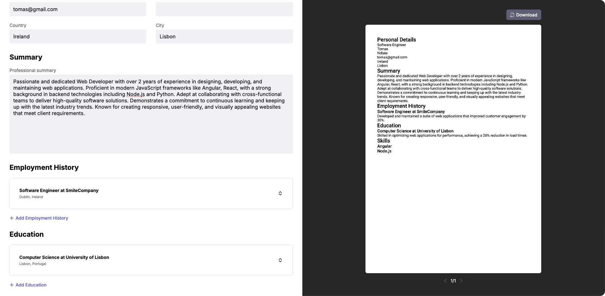

<!-- PROJECT LOGO -->

  

  <h1 align="center">ResumeBuilder</h1>

  

    Easily create and manage professional resumes!
     
     
    <a href="https://tomasndlate.github.io/resume-builder"><strong>Explore ResumeBuilder Live »</strong></a>
     
  

## Overview

The Resume Builder App is a web application that allows users to create professional resumes quickly and easily. 

Users can input their personal information, work experience, education, and skills, and generate a well-formatted resume that can be downloaded or shared.

## Features

- **Friendly Interface:** User-friendly interface for entering resume details.
- **Real-time pdf preview:** Real-time preview of the resume as you type.
- **Downloadable**: Download directly in PDF format.
- **Responsive Design:** Works seamlessly on desktop and mobile devices.

## Technologies Used

This project was built using the following technologies:

- Angular
- TypeScript
- HTML5
- CSS
- Node.js

Important npm packages:

- pdfMake
- pdfjs-dist

## Usage

1. **Create Resume:** Click **Create Resume** to create a new draft.

2. **Enter details:** Enter your personal details, work experience, education, skills, and more.

3. **Live Preview:** As you type the pdf preview is updated.

4. **Download:** Download the resume as a PDF.
  

## License

This project is licensed under the MIT License. You are free to use, modify, and distribute this software under the terms of the MIT License.

## Contact

For any inquiries, suggestions, or feedback, feel free to reach out:

